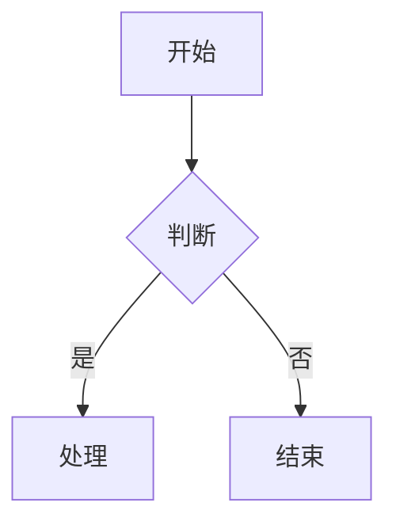
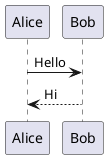

# 飞书文档写入技能

创建或更新飞书云文档，通过 Markdown 作为中间格式。**支持 Mermaid/PlantUML 图表自动转飞书画板**。

## 快速创建空白文档

最简方式创建一个新的飞书云文档：

```bash
feishu-cli doc create --title "文档标题" --output json
```

创建后**必须立即**完成以下权限设置流程：

### 标准文档创建权限流程（推荐）

1. **授予 `full_access` 权限**（给指定用户）：
   ```bash
   feishu-cli perm add <document_id> --doc-type docx --member-type email --member-id user@example.com --perm full_access --notification
   ```

2. **转移文档所有权**（如果需要）：
   ```bash
   feishu-cli perm transfer-owner <document_id> --doc-type docx --member-type email --member-id user@example.com --notification
   ```

3. **设置L2内部访问权限**（仅限内部访问）：
   ```bash
   feishu-cli perm public-update <document_id> \
     --external-access true \
     --security-entity anyone_can_view \
     --comment-entity anyone_can_view \
     --share-entity anyone \
     --link-share-entity closed \
     --invite-external true \
     --lock-switch false
   ```

4. **发送飞书消息通知用户文档已创建**

### 权限说明

- **L2权限**：对应 `link_share_entity: closed`，文档链接分享已关闭，仅限内部访问
- **外部访问**：`external_access: true` 允许外部用户通过邀请访问
- **邀请外部用户**：`invite_external: true` 允许邀请外部用户
- **安全实体**：`anyone_can_view` 允许任何人查看
- **评论权限**：`anyone_can_view` 允许任何人评论
- **分享实体**：`anyone` 允许任何人分享
- **锁定开关**：`false` 不锁定文档

## 核心概念

**Markdown 作为中间态**：本地文档与飞书云文档之间通过 Markdown 格式进行转换，中间文件存储在 `/tmp` 目录中。

## 使用方法

```bash
# 创建新文档
/feishu-write "文档标题"

# 更新已有文档
/feishu-write <document_id>
```

## 执行流程

### 创建新文档

1. **收集内容**
   - 与用户确认文档标题
   - 收集用户提供的内容或根据对话生成内容
   - 确认权限要求（L2内部权限、所有权转移等）

2. **生成 Markdown**
   - 在 `/tmp/feishu_write_<timestamp>.md` 创建 Markdown 文件
   - 使用标准 Markdown 语法，推荐使用 Mermaid 图表

3. **导入到飞书**
   ```bash
   feishu-cli doc import /tmp/feishu_write_<timestamp>.md --title "文档标题"
   ```

4. **完整权限设置流程**
   
   **步骤4.1：添加 full_access 权限**（给指定用户）
   ```bash
   feishu-cli perm add <document_id> --doc-type docx --member-type email --member-id user@example.com --perm full_access --notification
   ```
   
   **步骤4.2：转移文档所有权**（如果需要）
   ```bash
   feishu-cli perm transfer-owner <document_id> --doc-type docx --member-type email --member-id user@example.com --notification
   ```
   
   **步骤4.3：设置L2内部访问权限**
   ```bash
   feishu-cli perm public-update <document_id> \
     --external-access true \
     --security-entity anyone_can_view \
     --comment-entity anyone_can_view \
     --share-entity anyone \
     --link-share-entity closed \
     --invite-external true \
     --lock-switch false
   ```
   
   **步骤4.4：验证权限设置**
   ```bash
   feishu-cli perm public-get <document_id>
   ```

5. **通知用户**
   - 提供文档链接：`https://feishu.cn/docx/<document_id>`
   - 发送飞书消息通知用户文档已创建
   - 提供完整的权限设置报告

### 更新已有文档

1. **先读取现有内容**
   ```bash
   feishu-cli doc export <document_id> --output /tmp/feishu_existing.md
   ```

2. **修改内容**
   - 根据用户需求修改 Markdown 文件

3. **重新导入**
   ```bash
   feishu-cli doc import /tmp/feishu_updated.md --document-id <document_id>
   ```

## 支持的 Markdown 语法

| 语法 | 飞书块类型 | 说明 |
|------|-----------|------|
| `# 标题` | Heading1-6 | |
| `普通文本` | Text | |
| `- 列表项` | Bullet | 支持缩进嵌套 |
| `1. 有序项` | Ordered | 支持缩进嵌套 |
| `- [ ] 任务` | Todo | |
| `` ```code``` `` | Code | |
| `` ```mermaid``` `` | **Board（画板）** | **推荐使用** |
| `` ```plantuml``` `` / `` ```puml``` `` | **Board（画板）** | PlantUML 图表 |
| `> 引用` | QuoteContainer | 支持嵌套引用 |
| `> [!NOTE]` 等 | **Callout（高亮块）** | 6 种类型 |
| `---` | Divider | |
| `**粗体**` | 粗体样式 | |
| `*斜体*` | 斜体样式 | |
| `~~删除线~~` | 删除线样式 | |
| `<u>下划线</u>` | 下划线样式 | |
| `` `行内代码` `` | 行内代码样式 | |
| `$公式$` | **行内公式** | 支持一段多个公式 |
| `$$公式$$` | **块级公式** | 独立公式行 |
| `[链接](url)` | 链接 | |
| `| 表格 |` | Table | 超过 9 行或 9 列自动拆分，列拆分保留首列，列宽自动计算 |

### 推荐：使用 Mermaid / PlantUML 画图

在文档中画图时，**推荐使用 Mermaid**（也支持 PlantUML），会自动转换为飞书画板：

````markdown

````

````markdown

````

支持的 Mermaid 图表类型：
- ✅ flowchart（流程图，支持 subgraph）
- ✅ sequenceDiagram（时序图）
- ✅ classDiagram（类图）
- ✅ stateDiagram-v2（状态图）
- ✅ erDiagram（ER 图）
- ✅ gantt（甘特图）
- ✅ pie（饼图）
- ✅ mindmap（思维导图）

**Mermaid 注意事项**：
- 避免在节点标签中使用 `{}` 花括号（如 `{version}`），会触发解析错误
- **禁止使用 `par...and...end`**，飞书解析器完全不支持，改用 `Note over X: 并行执行...`
- sequenceDiagram 渲染复杂度组合超限：10+ participant + 2+ alt 块 + 30+ 长消息标签会触发服务端 500
- 安全阈值：participant ≤8、alt ≤1、消息标签尽量简短
- 导入失败的图表会自动降级为代码块展示

### Callout 高亮块

在文档中使用 Callout 语法创建飞书高亮块：

````markdown
> [!NOTE]
> 提示信息。

> [!WARNING]
> 警告信息。

> [!TIP]
> 技巧提示。

> [!CAUTION]
> 警示信息。

> [!IMPORTANT]
> 重要信息。

> [!SUCCESS]
> 成功信息。
````

Callout 内支持多行文本和子块（列表等）。

### 公式

````markdown
行内公式：圆面积 $S = \pi r^2$，周长 $C = 2\pi r$。

块级公式：
$$\int_{0}^{\infty} e^{-x^2} dx = \frac{\sqrt{\pi}}{2}$$
````

## 高级操作

### 添加画板

向文档添加空白画板：

```bash
# 在文档末尾添加画板
feishu-cli doc add-board <document_id>

# 在指定位置添加画板
feishu-cli doc add-board <document_id> --parent-id <block_id> --index 0
```

### 添加 Callout

向文档添加高亮块：

```bash
# 添加信息类型 Callout
feishu-cli doc add-callout <document_id> "提示内容" --callout-type info

# 添加警告类型 Callout
feishu-cli doc add-callout <document_id> "警告内容" --callout-type warning

# 指定位置添加
feishu-cli doc add-callout <document_id> "内容" --callout-type tip --parent-id <block_id> --index 0
```

Callout 类型：`info` (信息/蓝色), `warning` (警告/红色), `error` (错误/橙色), `success` (成功/绿色)

### 批量更新块

批量更新文档中的块内容：

```bash
# 从 JSON 文件批量更新
feishu-cli doc batch-update <document_id> --source-type content --file updates.json
```

JSON 格式示例：
```json
[
  {
    "block_id": "block_xxx",
    "block_type": 2,
    "content": "更新后的文本内容"
  }
]
```

## 输出格式

创建/更新完成后提供完整报告：

### 基本文档信息
- **文档标题**：创建的文档标题
- **文档 ID**：飞书文档的唯一标识符
- **文档 URL**：`https://feishu.cn/docx/<document_id>`
- **创建时间**：文档创建时间戳

### 权限设置报告
- **所有权状态**：
  - 新所有者：`<email>`
  - 所有权转移状态：✅ 成功 / ❌ 失败
  - 原所有者权限保留：`full_access`
- **L2权限设置**：
  - 外部访问：`true`/`false`
  - 链接分享权限：`closed`（L2内部权限）
  - 安全实体：`anyone_can_view`
  - 评论权限：`anyone_can_view`
  - 分享实体：`anyone`
  - 邀请外部用户：`true`/`false`
- **协作者权限**：
  - 添加的协作者列表
  - 权限级别：`view`/`edit`/`full_access`
  - 通知状态：已发送/未发送

### 内容摘要
- **文档长度**：块数量、表格数量、图表数量
- **图表状态**：
  - Mermaid/PlantUML 图表数量
  - 导入状态：✅ 成功以画板形式导入 / ⚠️ 降级为代码块
- **特色内容**：Callout、公式、表格等高级功能使用情况

### 操作状态
- **导入状态**：✅ 成功 / ❌ 失败
- **权限设置状态**：✅ 完成 / ⚠️ 部分完成 / ❌ 失败
- **通知状态**：✅ 已发送 / ❌ 未发送
- **建议后续操作**：如有需要调整的权限或内容

### 完整权限验证
```bash
# 验证公开权限设置
feishu-cli perm public-get <document_id>

# 验证协作者列表
feishu-cli perm list <document_id>
```

## 示例

```bash
# 创建新的会议纪要
/feishu-write "2024-01-21 周会纪要"

# 更新现有文档
/feishu-write <document_id>
```
