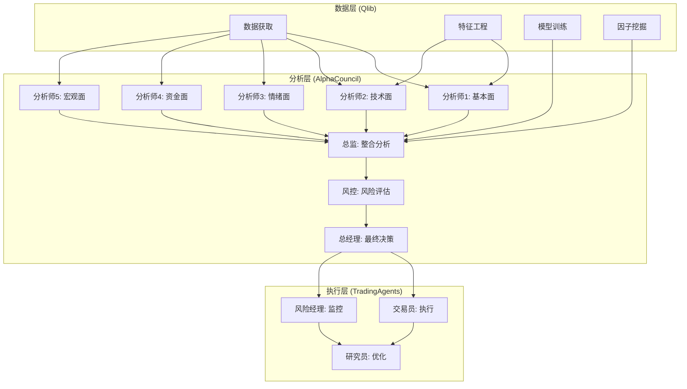

# 量化融合智能体系统

一个融合了Qlib、AlphaCouncil、TradingAgents三大项目的超级量化交易智能体系统。本技能提供了一个完整的端到端量化投资解决方案，结合了数据基础设施、多智能体决策和实时交易执行。

## 系统架构



## 核心功能模块

### 1. 数据基础设施 (Qlib)
- **数据获取**：支持股票、期货、加密货币等市场数据
- **特征工程**：自动生成技术指标、基本面因子、市场情绪因子
- **模型训练**：支持监督学习、强化学习、深度学习模型
- **因子挖掘**：基于RD-Agent的自动化因子发现和优化

### 2. 多智能体决策系统 (AlphaCouncil)
- **10角色专业团队**：
  - 5名分析师：基本面、技术面、情绪面、资金面、宏观面
  - 2名总监：整合分析、战略规划  
  - 2名风控：风险评估、合规审查
  - 1名总经理：最终决策
- **四阶段工作流**：
  1. 并行分析：各分析师独立分析
  2. 整合报告：总监汇总分析结果
  3. 风控审核：风险评估和合规检查
  4. 最终决策：总经理做出投资决定

### 3. 交易执行框架 (TradingAgents)
- **7种专业角色**：
  - 基础分析师：市场趋势分析
  - 情绪分析师：市场情绪监控
  - 新闻分析师：新闻事件影响评估
  - 技术分析师：技术指标分析
  - 研究员：策略研究和优化
  - 交易员：订单执行和管理
  - 风险经理：风险控制和监控
- **动态辩论机制**：各角色通过讨论达成共识
- **多模型支持**：GPT、Gemini、Claude、Qwen等

## 使用流程

### 第一阶段：数据准备
1. 选择目标市场（A股、美股、港股等）
2. 配置数据源和API密钥
3. 设置分析时间范围
4. 选择关注的股票或指数

### 第二阶段：智能体分析
1. 启动多智能体分析系统
2. 各角色并行分析市场数据
3. 生成详细分析报告
4. 风险评估和合规检查

### 第三阶段：决策与执行
1. 综合所有分析生成投资建议
2. 制定具体的交易策略
3. 执行交易并监控风险
4. 持续优化和调整策略

## 配置文件

系统需要以下配置文件：

1. **数据源配置** (`config/data_sources.yaml`):
   ```yaml
   stock_data:
     provider: "akshare"  # 或 tushare, baostock
     api_key: "your_api_key"
   
   market_data:
     real_time: true
     update_frequency: "1m"
   
   crypto_data:
     enabled: false
     exchanges: ["binance", "okx"]
   ```

2. **模型配置** (`config/models.yaml`):
   ```yaml
   llm_providers:
     openai:
       api_key: "sk-..."
       model: "gpt-4"
     
     gemini:
       api_key: "AI..."
       model: "gemini-2.0-flash"
     
     deepseek:
       api_key: "sk-..."
       model: "deepseek-chat"
   ```

3. **交易配置** (`config/trading.yaml`):
   ```yaml
   broker:
     type: "simulation"  # simulation, paper, real
     commission: 0.0003
   
   risk_management:
     max_position_size: 0.1
     max_daily_loss: 0.05
     stop_loss: 0.03
   ```

## 快速开始

### 1. 初始化系统
```bash
# 安装依赖
pip install -r requirements.txt

# 初始化配置
python scripts/init_config.py

# 启动数据服务
python scripts/start_data_service.py
```

### 2. 运行分析
```python
from quant_fusion.core import QuantFusionSystem

# 创建系统实例
system = QuantFusionSystem()

# 配置分析参数
config = {
    "market": "A股",
    "symbols": ["000001.SZ", "000002.SZ", "600519.SH"],
    "timeframe": "1d",
    "analysis_period": "2024-01-01:2024-12-31"
}

# 运行完整分析流程
results = system.run_full_analysis(config)

# 查看分析报告
print(results["analysis_report"])
print(results["investment_recommendations"])
print(results["risk_assessment"])
```

### 3. 执行交易
```python
# 生成交易信号
signals = system.generate_trading_signals(results)

# 执行交易
execution_results = system.execute_trades(
    signals=signals,
    broker_type="simulation",
    capital=100000
)

# 查看交易结果
print(execution_results["trades"])
print(execution_results["performance"])
print(execution_results["risk_metrics"])
```

## 输出格式

系统生成以下输出文件：

1. **分析报告** (`reports/analysis_report.md`):
   - 市场概况分析
   - 个股深度分析
   - 投资建议
   - 风险提示

2. **交易日志** (`logs/trading_log.json`):
   - 所有交易记录
   - 执行价格和数量
   - 手续费和成本
   - 盈亏情况

3. **绩效报告** (`reports/performance_report.md`):
   - 收益率曲线
   - 风险指标（夏普比率、最大回撤等）
   - 基准比较
   - 归因分析

4. **监控面板** (`dashboards/monitor.html`):
   - 实时仓位监控
   - 风险暴露分析
   - 市场情绪指标
   - 系统健康状态

## 高级功能

### 1. 自动化因子挖掘
基于Qlib的RD-Agent，系统可以：
- 自动发现新的有效因子
- 优化现有因子组合
- 测试因子在不同市场环境的表现
- 生成因子研究报告

### 2. 多智能体协作优化
- 智能体间知识共享
- 协作学习和经验积累
- 动态角色分配和调整
- 冲突解决和共识达成

### 3. 实时风险监控
- 市场风险实时监测
- 流动性风险预警
- 操作风险控制
- 合规风险检查

### 4. 策略回测和优化
- 历史数据回测
- 参数优化和调参
- 过拟合检测和防止
- 稳健性测试

## 故障排除

### 常见问题

1. **数据获取失败**
   - 检查API密钥配置
   - 验证网络连接
   - 确认数据源服务状态

2. **模型调用超时**
   - 检查LLM API密钥
   - 调整请求频率
   - 使用备用模型提供商

3. **交易执行错误**
   - 验证账户权限
   - 检查资金充足性
   - 确认市场交易时间

### 调试模式
```bash
# 启用详细日志
export QUANT_FUSION_DEBUG=1

# 查看系统日志
tail -f logs/system.log

# 检查服务状态
python scripts/check_services.py
```

## 安全注意事项

1. **API密钥保护**
   - 不要将API密钥提交到版本控制
   - 使用环境变量存储敏感信息
   - 定期轮换密钥

2. **交易安全**
   - 实盘交易前充分测试
   - 设置合理的风险限制
   - 监控异常交易行为

3. **数据隐私**
   - 加密存储敏感数据
   - 遵守数据使用协议
   - 定期清理历史数据

## 扩展和定制

### 添加新的数据源
1. 在 `data_providers/` 目录创建新的数据源类
2. 实现标准数据接口
3. 更新配置文件

### 创建新的分析角色
1. 在 `agents/analysts/` 目录创建新的分析师类
2. 定义分析方法和输出格式
3. 注册到智能体工厂

### 集成新的交易接口
1. 在 `brokers/` 目录创建新的经纪商接口
2. 实现标准交易接口
3. 更新交易配置

## 参考资源

- [Qlib官方文档](https://qlib.readthedocs.io/)
- [AlphaCouncil GitHub仓库](https://github.com/164149043/AlphaCouncil)
- [TradingAgents GitHub仓库](https://github.com/TauricResearch/TradingAgents)
- [量化投资最佳实践](references/quant_best_practices.md)
- [多智能体系统设计](references/multi_agent_design.md)

## 技术支持

遇到问题时：
1. 查看 `docs/troubleshooting.md`
2. 检查 `logs/` 目录下的日志文件
3. 提交Issue到GitHub仓库
4. 联系技术支持团队

---

**重要提示**：量化交易存在风险，过往表现不代表未来收益。实盘交易前请充分测试，并根据自身风险承受能力进行投资。